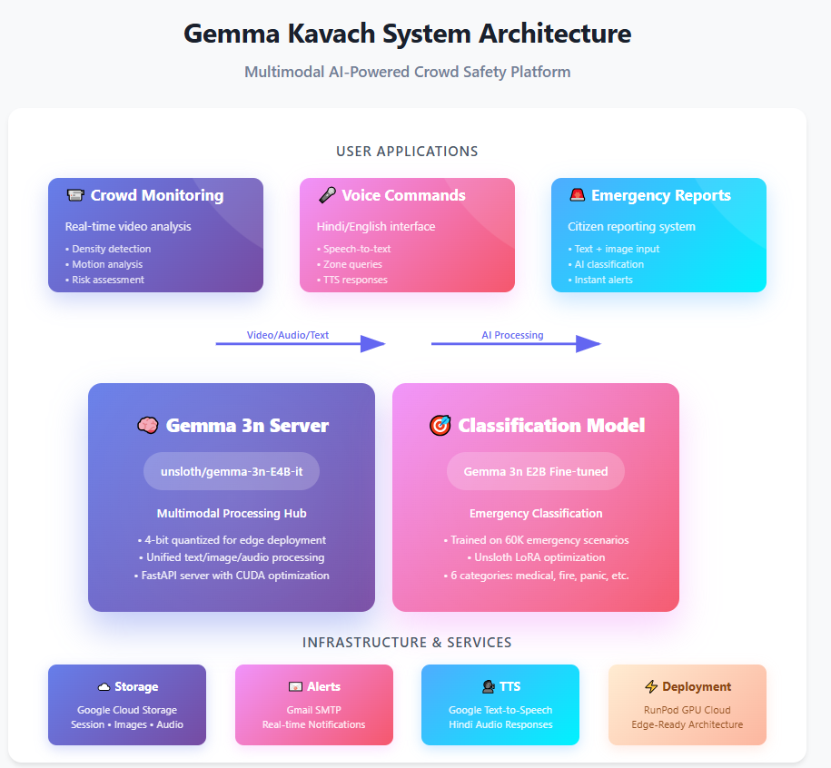

# Gemma Kavach - AI-Powered Crowd Safety Suite

<div align="center">
  
  
  **An intelligent crowd safety monitoring and emergency response system powered by Google's Gemma AI**
  
  [](https://opensource.org/licenses/MIT)
  [](https://www.python.org/downloads/)
  [](https://fastapi.tiangolo.com/)
  [](https://ai.google.dev/gemma)
</div>

## 🎯 Overview

Gemma Kavach is a comprehensive AI-powered crowd safety suite designed for real-time monitoring and emergency response in crowded environments like festivals, events, public gatherings, and melas. The system combines computer vision, natural language processing, and voice recognition technologies to provide a complete safety monitoring solution.

### 🏗️ System Architecture

<div align="center">
  
</div>

## ✨ Key Features

### 🎥 **Vision Server** - Real-time Crowd Monitoring
- **Dual Analysis Engine**: Simultaneous crowd density and motion behavior detection
- **Risk Assessment**: AI-powered risk scoring with automated alert system
- **Live Dashboard**: Real-time analytics with visual indicators
- **Cloud Storage**: Google Cloud Storage integration for data persistence

### 🎤 **Voice Server** - Hands-free Command Interface
- **Hindi-English Voice Commands**: Natural language processing for Indian contexts
- **Zone Status Queries**: Real-time security data retrieval via voice
- **Text-to-Speech**: Hindi audio responses with Google TTS
- **Mobile Optimized**: Cross-platform audio support

### 📱 **Emergency Reporting** - Citizen-facing Emergency Classification
- **AI Classification**: Fine-tuned Gemma model for emergency categorization
- **Mobile Interface**: Cyberpunk-styled responsive web app
- **Image Documentation**: Photo upload with emergency reports
- **Automated Alerts**: Email notifications to response teams

### 🤖 **Fine-tuning Pipeline** - Custom AI Model Training
- **Emergency Classification**: 6-category Hinglish emergency detection
- **LoRA Fine-tuning**: Parameter-efficient training on Gemma 3n 2B
- **Synthetic Data Generation**: 60,000 samples across emergency categories
- **Production Ready**: Optimized inference and deployment

## 🚀 Quick Start

### Prerequisites

- **Hardware**: RTX 4090 or equivalent GPU (24GB VRAM recommended)
- **Software**: Python 3.8+, CUDA-compatible GPU drivers
- **Services**: Google Cloud Storage, Gmail SMTP (optional)

### 1. Clone Repository

```bash
git clone <repository-url>
cd gemma-kavach
```

### 2. Environment Setup

```bash
# Create virtual environment
python -m venv venv

# Activate virtual environment
# Windows
venv\Scripts\activate
# Linux/Mac
source venv/bin/activate

# Install dependencies
pip install -r requirements.txt
```

### 3. Configure Environment Variables

Create `.env` files in respective server directories:

```bash
# GemmaServer/.env
HUGGINGFACE_TOKEN=your_hf_token

# Gemma_Kavach_Vision_Server/.env
BUCKET_NAME=your-gcs-bucket
GOOGLE_APP_PASSWORD=your_gmail_password

# Gemma_Kavach_Voice_Server/.env
SERVER_URL=https://your-gemma-server.proxy.runpod.net/
GOOGLE_TEXT_TO_SPEECH=your_google_tts_key

# User_Chat_Server/.env
GOOGLE_APP_PASSWORD=your_gmail_password
BUCKET_NAME=your-gcs-bucket
```

### 4. Start Services

#### Core Gemma Server (Port 8000)
```bash
cd GemmaServer
python gemma_server.py
```

#### Vision Monitoring Server (Port 38277)
```bash
cd Gemma_Kavach_Vision_Server
uvicorn main:app --host 0.0.0.0 --port 38277 --reload
```

#### Voice Command Server (Port 7860)
```bash
cd Gemma_Kavach_Voice_Server
uvicorn main:app --host 0.0.0.0 --port 7860 --reload
```

#### Emergency Reporting Server (Port 8501)
```bash
cd User_Chat_Server
python main.py
```

## 📊 System Components

### 🎥 Vision Server - Crowd Safety Monitoring

**Location**: `Gemma_Kavach_Vision_Server/`

**Features**:
- Real-time video frame analysis
- Crowd density detection (Low/Medium/High)
- Motion behavior analysis (Calm/Chaotic)
- Risk scoring algorithm with alert thresholds
- Session management and analytics

**Usage**:
```bash
# Access dashboard
http://localhost:38277

# API endpoints
POST /api/session/create          # Create monitoring session
POST /api/session/{id}/frame      # Analyze video frame
GET  /api/session/{id}            # Get session analytics
```

**Risk Assessment Matrix**:
| Density | Motion | Risk Level |
|---------|--------|------------|
| High | Chaotic | CRITICAL |
| Medium | Chaotic | HIGH |
| Low | Chaotic | MODERATE |
| High | Calm | MODERATE |
| Medium/Low | Calm | SAFE |

### 🎤 Voice Server - Voice Command Interface

**Location**: `Gemma_Kavach_Voice_Server/`

**Features**:
- Hindi-English voice transcription
- Zone security data queries
- Natural language processing
- Hindi TTS responses
- Mobile audio support

**Supported Commands**:
- `"ज़ोन बी की सिक्योरिटी अपडेट दीजिए"`
- `"Zone C ka kya haal hai?"`
- `"मुझे ज़ोन ए की जानकारी चाहिए"`

**Usage**:
```bash
# Access voice interface
http://localhost:7860

# API endpoints
POST /api/voice-command           # Process voice commands
GET  /api/monitoring/status       # System health check
```

### 📱 Emergency Reporting - Citizen Interface

**Location**: `User_Chat_Server/`

**Features**:
- AI-powered emergency classification
- 6 emergency categories (Child Lost, Crowd Panic, Medical Help, etc.)
- Image upload and documentation
- Automated email alerts
- Mobile-responsive interface

**Emergency Categories**:
1. 🚨 **Child Lost** (CRITICAL)
2. 👥 **Crowd Panic** (CRITICAL)
3. 🏥 **Medical Help** (HIGH)
4. 🔥 **Small Fire** (HIGH)
5. 🗣️ **Need Interpreter** (MEDIUM)
6. 📦 **Lost Item** (LOW)

**Usage**:
```bash
# Access emergency form
http://localhost:8501

# API endpoints
POST /ask_class                   # Classify emergency text
POST /emergency_report            # Submit emergency report
```

### 🤖 AI Model Fine-tuning

**Location**: `FineTunning/`

**Features**:
- Custom emergency classification model
- LoRA fine-tuning on Gemma 3n 2B
- Synthetic data generation (60,000 samples)
- Hinglish (Hindi-English) text processing

**Training Pipeline**:
```bash
# Generate training data
python data.py

# Fine-tune model
python job.py

# Test model
python test.py
```

**Model Performance**:
- Base Model: `unsloth/gemma-3n-E2B-it`
- Training Time: 2-4 hours (RTX 4090)
- Expected Accuracy: >95%
- Memory Usage: ~18GB VRAM

### 🧪 Testing Infrastructure

**Location**: `test_server/`

**Features**:
- API endpoint validation
- Text generation testing
- Image processing validation
- Audio transcription testing

**Test Scripts**:
```bash
python test_text.py    # Test text generation
python test_image.py   # Test image analysis
python test_audio.py   # Test audio processing
```

## 🛠️ Technology Stack

### Core Technologies
- **AI Framework**: Google Gemma 3n 2B + LoRA Fine-tuning
- **Backend**: FastAPI, Uvicorn
- **Frontend**: HTML5, CSS3, JavaScript (Cyberpunk UI)
- **Computer Vision**: OpenCV, PIL
- **Audio Processing**: Librosa, SoundFile
- **Cloud Storage**: Google Cloud Storage
- **Database**: CSV-based session management

### Dependencies
```
# Core ML and AI
unsloth                    # Gemma model fine-tuning
huggingface_hub           # Model hosting
transformers              # NLP framework
torch                     # Deep learning

# Web Framework
fastapi                   # API framework
uvicorn                   # ASGI server
python-multipart          # File upload support

# Audio/Video Processing
librosa                   # Audio analysis
opencv-python             # Computer vision
pillow                    # Image processing
imageio                   # Media I/O

# Cloud Services
google-cloud-storage      # GCS integration
google-cloud-texttospeech # TTS service
aiohttp                   # Async HTTP client
```

## 📁 Project Structure

```
gemma-kavach/
├── 📁 GemmaServer/                    # Core Gemma 3n inference server
│   ├── gemma_server.py               # Main server application
│   ├── gemma_loader.py               # Model loading utilities
│   └── README.md                     # Server documentation
│
├── 📁 Gemma_Kavach_Vision_Server/    # Real-time crowd monitoring
│   ├── main.py                       # FastAPI application
│   ├── routes.py                     # API endpoints
│   ├── utils.py                      # Analysis utilities
│   └── static/                       # Web dashboard
│       ├── index.html                # Main dashboard
│       ├── app.js                    # Frontend logic
│       └── style.css                 # UI styling
│
├── 📁 Gemma_Kavach_Voice_Server/     # Voice command interface
│   ├── main.py                       # Voice server
│   ├── routes.py                     # Voice endpoints
│   ├── utils.py                      # Voice processing
│   ├── sessions_data.csv             # Zone data
│   └── static/                       # Voice interface
│
├── 📁 User_Chat_Server/              # Emergency reporting
│   ├── main.py                       # Emergency server
│   ├── routes.py                     # Report endpoints
│   ├── utils.py                      # Classification utils
│   └── static/                       # Emergency form
│
├── 📁 FineTunning/                   # AI model training
│   ├── data.py                       # Data generation
│   ├── job.py                        # Training pipeline
│   ├── test.py                       # Model testing
│   └── Datasets/                     # Training datasets
│
├── 📁 test_server/                   # API testing
│   ├── test_text.py                  # Text API tests
│   ├── test_image.py                 # Image API tests
│   └── test_audio.py                 # Audio API tests
│
├── 📁 Dev_Commands/                  # Deployment scripts
│   └── runpod.md                     # RunPod commands
│
├── 📁 images/                        # Project assets
│   ├── logo.PNG                      # Project logo
│   ├── tech_arch.PNG                 # Architecture diagram
│   └── prac_example.PNG              # Usage example
│
├── requirements.txt                   # Python dependencies
├── LICENSE                           # MIT license
└── README.md                         # This file
```

## 🚀 Deployment Options

### Local Development
```bash
# Start all services locally
python GemmaServer/gemma_server.py &
cd Gemma_Kavach_Vision_Server && uvicorn main:app --port 38277 &
cd Gemma_Kavach_Voice_Server && uvicorn main:app --port 7860 &
cd User_Chat_Server && python main.py &
```

### RunPod Deployment
See `Dev_Commands/runpod.md` for detailed deployment instructions.

### Docker Deployment
```dockerfile
FROM python:3.9-slim

WORKDIR /app
COPY requirements.txt .
RUN pip install -r requirements.txt

COPY . .
EXPOSE 8000 38277 7860 8501

# Use supervisord or similar for multi-service deployment
```

### Production Deployment
```bash
# Use production ASGI server
pip install gunicorn
gunicorn main:app -w 4 -k uvicorn.workers.UvicornWorker --bind 0.0.0.0:8000
```

## 📊 Performance Metrics

### System Requirements
- **GPU**: RTX 4090 (24GB VRAM) or equivalent
- **RAM**: 32GB+ recommended
- **Storage**: 50GB+ for models and data
- **Network**: High-speed internet for cloud services

### Expected Performance
- **Video Analysis**: 2-3 frames/second
- **Voice Processing**: <2 seconds response time
- **Emergency Classification**: <1 second
- **Model Training**: 2-4 hours (60K samples)

## 🔧 Configuration

### Environment Variables

**Core Settings**:
```bash
# Model and inference
HUGGINGFACE_TOKEN=your_token
SERVER_URL=your_gemma_server_url

# Cloud services
BUCKET_NAME=your_gcs_bucket
GOOGLE_APP_PASSWORD=your_gmail_password
GOOGLE_TEXT_TO_SPEECH=your_tts_key

# Server configuration
HOST=0.0.0.0
DEBUG=False
```

### Port Configuration
| Service | Port | Purpose |
|---------|------|---------|
| Gemma Server | 8000 | Core AI inference |
| Vision Server | 38277 | Crowd monitoring |
| Voice Server | 7860 | Voice commands |
| Emergency Server | 8501 | Emergency reports |

## 🛡️ Security Considerations

### Data Protection
- Audio files processed in memory (not stored)
- Images stored securely in Google Cloud Storage
- HTTPS required for production deployment
- CORS policies configured for web security

### API Security
- Rate limiting for production environments
- Input validation and sanitization
- Secure file upload handling
- Environment variable protection

## 🔍 Monitoring & Analytics

### Health Checks
```bash
# Check all services
curl http://localhost:8000/health       # Gemma server
curl http://localhost:38277/api/monitoring/status  # Vision server
curl http://localhost:7860/api/monitoring/status   # Voice server
curl http://localhost:8501/health       # Emergency server
```

### Key Metrics
- **Vision Server**: Frames analyzed, risk scores, alert counts
- **Voice Server**: Command success rate, transcription accuracy
- **Emergency Server**: Classification accuracy, response times
- **System Health**: Memory usage, GPU utilization, API latency

## 🤝 Contributing

1. Fork the repository
2. Create a feature branch (`git checkout -b feature/amazing-feature`)
3. Commit your changes (`git commit -m 'Add amazing feature'`)
4. Push to the branch (`git push origin feature/amazing-feature`)
5. Open a Pull Request

### Development Guidelines
- Follow Python PEP 8 style guidelines
- Add comprehensive tests for new features
- Update documentation for API changes
- Test on multiple platforms and browsers

## 📄 License

This project is licensed under the MIT License - see the [LICENSE](LICENSE) file for details.

## 🆘 Support & Troubleshooting

### Common Issues

**1. GPU Memory Issues**
```bash
# Check GPU usage
nvidia-smi

# Clear GPU cache
torch.cuda.empty_cache()
```

**2. Model Loading Errors**
```bash
# Verify HuggingFace token
huggingface-cli login

# Check model permissions
```

**3. Service Connection Issues**
```bash
# Check port availability
netstat -tlnp | grep :8000

# Restart services
pkill -f uvicorn
```

### Getting Help
- Check individual service README files
- Review server logs for error messages
- Verify environment variable configuration
- Test API endpoints individually

## 🙏 Acknowledgments

- **Google AI** for Gemma models and infrastructure
- **Unsloth** for efficient fine-tuning capabilities
- **FastAPI** community for excellent web framework
- **Hugging Face** for model hosting and transformers

## 📚 Citation

Glenn Cameron, Omar Sanseviero, Gus Martins, Ian Ballantyne, Kat Black, Mark Sherwood, Milen Ferev, Ronghui Zhu, Nilay Chauhan, Pulkit Bhuwalka, Emily Kosa, and Addison Howard. Google - The Gemma 3n Impact Challenge. https://kaggle.com/competitions/google-gemma-3n-hackathon, 2025. Kaggle.

## 📈 Roadmap

### Upcoming Features
- [ ] Real-time WebSocket streaming
- [ ] Advanced analytics dashboard
- [ ] Multi-language support expansion
- [ ] Mobile app development
- [ ] Integration with emergency services
- [ ] Advanced computer vision models
- [ ] Distributed deployment support

### Version History
- **v1.0.0**: Initial release with core functionality
- Enhanced AI model fine-tuning
- Comprehensive web interfaces
- Multi-modal processing capabilities
- Production-ready deployment

---

<div align="center">
  <p><strong>Gemma Kavach - Protecting crowds with AI-powered intelligence</strong></p>
  <p>Made with ❤️ for safer communities</p>
</div>
